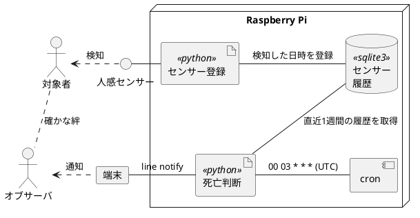

# death-notice

```plantuml
@startuml
actor 対象者 as human
actor オブサーバ as observer
card 端末 as device
interface 人感センサー as sensor
node "Raspberry Pi" as raspy {
    artifact センサー登録 as human_python <<python>>
    artifact 死亡判断 as cycle_python <<python>>
    component cron as cron
    database "センサー\n履歴" as sqlite <<sqlite3>>
}

human <.r. sensor : 検知
observer <.r. device : 通知
sensor -r- human_python
human .. observer : 確かな絆
human_python -r- sqlite : 検知した日時を登録
cycle_python -u- sqlite : 直近1週間の履歴を取得
cron -l- cycle_python : 00 03 * * * (UTC)
cycle_python -l- device : line notify
@enduml
```