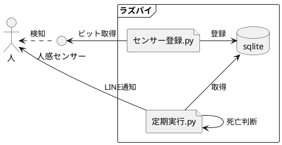

# death-notice

```plantuml
@startuml
actor 人 as human
interface 人感センサー as sensor
frame ラズパイ as raspy {
    file センサー登録.py as human_python
    file 定期実行.py as cycle_python
    database sqlite as sqlite
}

human <.r. sensor : 検知
sensor <-r- human_python : ビット取得
human_python -r-> sqlite : 登録
cycle_python -u-> sqlite : 取得
cycle_python -l-> human : LINE通知
cycle_python --> cycle_python : 死亡判断
@enduml
```